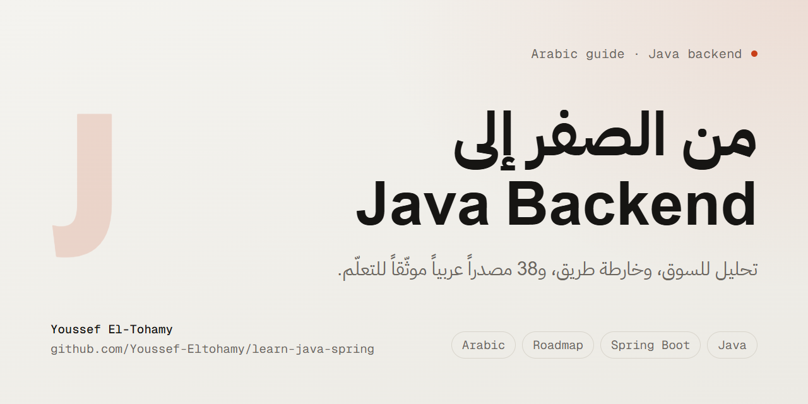

  

  
  
  

**In English:** an Arabic-language guide for going from zero to a Java backend engineer role, built on an actual reading of the Egyptian and international job market rather than generic advice. It covers a market-reality check, a six-stage roadmap with pass gates, and 38 vetted Arabic-language video resources, each checked link by link.

---

# مسار Java & Spring، دليل عربى

دليل عربى للانتقال من الصفر لوظيفة `Java Backend Engineer`، مبنى على تحليل لسوق العمل المصرى والدولى بدل النصايح العامة.

**اقرأ الدليل:** https://youssef-eltohamy.github.io/learn-java-spring/

---

## إيه اللى جوه

| الصفحة | المحتوى |
|---|---|
| **[تحليل السوق](https://youssef-eltohamy.github.io/learn-java-spring/00-market-analysis.html)** | تفكيك النصيحة الشائعة («`Java` هى الطلب الأكبر والعدد قليل والراتب أعلى») لأربع دعاوى منفصلة، وتقييم كل واحدة بالأرقام. |
| **[خارطة الطريق](https://youssef-eltohamy.github.io/learn-java-spring/01-roadmap.html)** | ست مراحل بمدد واقعية، واختبار اجتياز لكل مرحلة، ومؤشرات تحذير مبكرة. |
| **[المصادر العربية](https://youssef-eltohamy.github.io/learn-java-spring/02-resources.html)** | ٣٨ مصدر يوتيوب لكل عنصر فى الخريطة، مرتبة بترتيب المشاهدة ومعاها نبذة و«ليه دى». صفحة تفاعلية فيها بحث. |

## ليه الدليل ده مختلف

**بيقول الحاجات المش مريحة.** السوق مستقطب مش ناقص: فايض `junior` ونقص حاد `senior`. التوقع الواقعى لأول وظيفة **١٨-٣٠ شهر**، مش ٦.

**كل رابط اتحقق منه فعلياً.** الروابط اتفتحت واحد واحد واتقرا منها العنوان واسم القناة وعدد الفيديوهات. اتشال مصدران ظهروا فى البحث: واحد معنون «جافا» وهو فعلياً كورس أندرويد، وواحد رابطه ميت.

**الفجوات معلّمة صراحةً.** ست مواضيع مفيش ليها محتوى عربى مقبول، منها `Spring Security` بعمق و`JUnit`/`Mockito` و`Redis`. كل فجوة مكتوب جنبها البديل الإنجليزى بالاسم، عشان محدش يضيّع وقت يدوّر على كورس مش موجود.

## التقنيات

صفحات `HTML` ثابتة، `RTL` بالكامل، من غير أى مكتبات أو اتصال خارجى. فيها ثيم فاتح وداكن، وستايل طباعة، وشغالة `offline`. كل صفحة ليها نسخة `markdown` جنبها بنفس الاسم.

## المساهمة

لو لقيت رابط ميت، أو تعرف مصدر عربى أحسن لعنصر معين، أو عندك اعتراض على حكم فى تحليل السوق، افتح `issue`. الملاحظات على الفجوات مفيدة بشكل خاص.

## إخلاء مسؤولية

المحتوى ده اجتهاد شخصى للتعلم، مش استشارة مهنية. الأرقام والروابط صحيحة وقت آخر تحديث (٢٠٢٦-٠٨-٢٠) وممكن تتغير.

---

*المحتوى تحت رخصة [CC BY 4.0](https://creativecommons.org/licenses/by/4.0/deed.ar): استخدمه وعدّل فيه وانشره، بس اذكر المصدر.*
